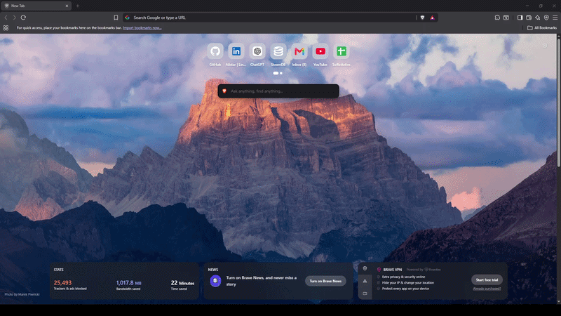

# JobLens

A Chromium extension that extracts key information from job postings to help quickly evaluate whether a role is a good match.

### Why I built this
---
When applying for jobs, I noticed I was repeating the same process over and over again:

- Checking required experience
- Scanning for relevant technologies
- Trying to quickly judge if a role is worth applying for

Job postings often contain the same type of information, but it is scattered across long descriptions. I wanted a faster way to get an overview without manually reading everything every time.

That is why I built JobLens.

It extracts relevant information from job postings and shows it in a simple, draggable panel.

----
### Current Status
This project is still in active development.

At the moment, JobLens works on LinkedIn job postings. One of the next steps is to refactor this system so it becomes website-agnostic, allowing support for multiple job platforms.

---
### Features
- Extracts required experience from LinkedIn job postings
- Detects technologies and frameworks mentioned in the job description
- Draggable UI panel
- Automatically updates when a different job is selected
- Lightweight and runs directly in the browser

---
### Planned improvements

Some of the next steps include:
- Refactoring extraction logic to support multiple job websites
- Improving robustness of parsing job descriptions
- Better detection of technologies and experience
- Optional match scoring based on user preferences (tech stack)
- General UI/UX improvements
---
### Tech Stack
- Javascript
- Chromium Extension (Manifest V3)
- HTML
- CSS
---
### What I learned
Building this project taught me a lot about working with real-world web data.

Some of the things I learned Include:
- Working with inconsistent HTML structures
- Designing a separation between UI and data extraction logic
- Handling cases where initial assumptions become limiting
- Iterating and refactoring based on real usage instead of initial design

One of the biggest insights so far is that starting with a working, narrow solution is often better than trying to support everything from the beginning. The current LinkedIn-specific implementation is exactly what will make the upcoming refactor possible.

---
### Feedback
If you have suggestions or ideas for improvements, feel free to connect with me on LinkedIn.
